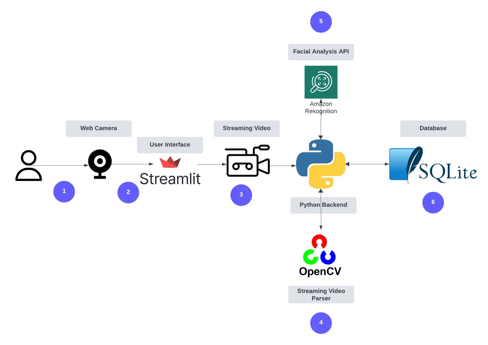

# EmoTrack: Real-Time Emotion Tracking Application

EmoTrack is a real-time emotion tracking application that utilizes facial recognition to capture emotions from a webcam feed. The application is built on Python using Streamlit for the frontend and SQLite for the backend storage. AWS Rekognition is used for emotion detection. This README provides setup instructions and information on how to run the application.


<a href="https://buymeacoffee.com/jjespinozag" target="_blank">
    
</a>

## Features
**Detects Emotions from Streaming Video**


---


**Daily graphs to spot trends in emotional states**


## How it Works


## How It Works

The application follows a streamlined workflow for emotion tracking, utilizing various technologies from Python, OpenCV, Amazon AWS Rekognition, and SQLite:

1. **Application Initialization**: Upon launching the application, it starts capturing live video feed from your computer's camera.

2. **Streamlit Framework**: Written in Python, the Streamlit framework provides an intuitive user interface that allows you to easily toggle the camera on or off and view real-time emotion metrics.

3. **Video Processing**: The video feed is channeled into the Python backend.

4. **Frame Sampling with OpenCV**: The Python script employs OpenCV to periodically sample frames from the live video. These frames are compressed to optimize application performance and reduce memory usage.

5. **Facial Analysis via AWS Rekognition**: Each sampled frame is sent to Amazon AWS Rekognition's API for facial analysis. If a human face is detected, the emotion with the highest probability score is identified and returned.

6. **Data Storage in SQLite**: The recognized emotion, along with the timestamp of the frame, is saved into a SQLite database. This data can later be queried and visualized through the application's dashboard for in-depth emotion tracking and analysis.


## Prerequisites

- Python 3.x
- AWS account with Rekognition service enabled
- AWS CLI installed and configured
- Webcam

## Installation

1. **Clone the Repository**

    ```
    git clone https://github.com/espin086/EmoTrack
    cd EmoTrack
    ```

2. **Install Required Python Packages**

    Create a virtual environment (recommended).

    ```
    python3 -m venv venv
    source venv/bin/activate  # On Windows, use `venv\\Scripts\\activate`
    ```

    Now install the required packages.

    ```
    pip3 install -r requirements.txt
    ```

    Create a `requirements.txt` file with the following content:

    ```
    streamlit
    opencv-python
    pandas
    seaborn
    matplotlib
    boto3
    pytz
    sqlite
    ```

3. **Configure AWS Rekognition**

    Install the AWS CLI and configure it with your AWS credentials.

    ```
    aws configure
    ```

    Follow the prompts to enter your AWS Access Key ID, Secret Access Key, default region, and output format.

4. **Set Up AWS Rekognition**

    Make sure you have set up the Rekognition service in the AWS Console.

## Usage

1. **Start the Streamlit App**

    With your virtual environment activated, run the Streamlit app.

    ```
    streamlit run EmoTrack.py
    ```


2. **Navigate to the App**

    Open your web browser and navigate to the address shown in your terminal, usually `http://localhost:8501`.

3. **Use the App**

    - Choose "Webcam Feed" to start capturing your emotions in real-time.
    - Choose "Display Graph" to visualize the tracked emotions over time.

## Notes

1. The emotion tracking will only start when you press the "Start" button and will stop when you press the "Stop" button.
2. The graph is generated from the data in the SQLite database.

## Troubleshooting

If you encounter issues with the webcam feed, make sure your webcam is properly connected and configured.

## License

MIT License.

